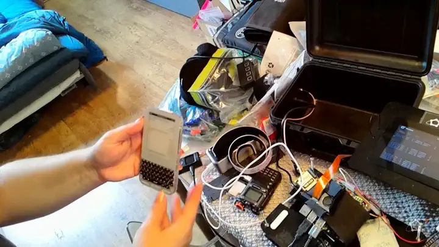
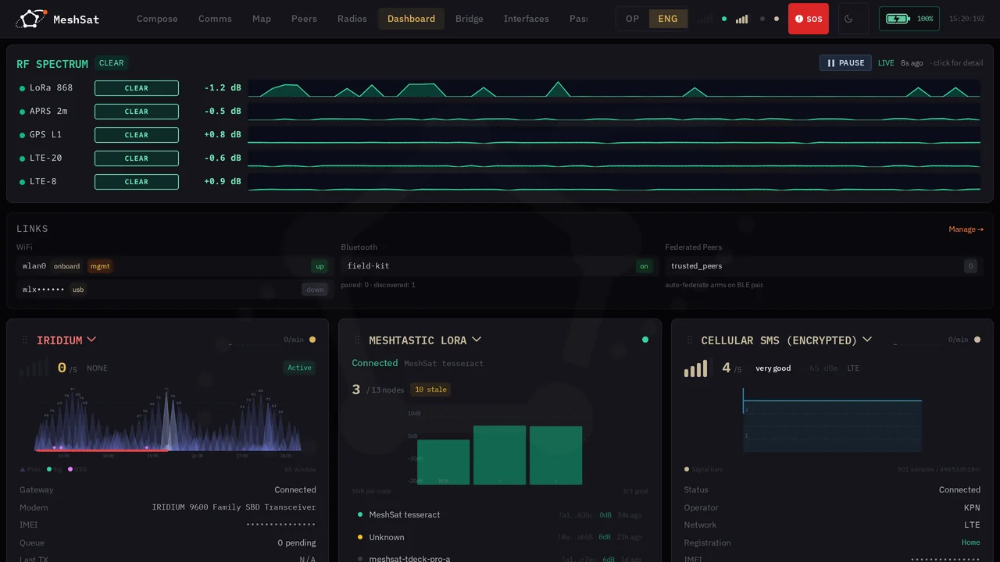

<div align="center">

<picture>
  <source media="(prefers-color-scheme: dark)" srcset="docs/images/mark-dark.png">
  
</picture>

### Keep a message moving when the network is gone.

[](https://github.com/meshsat/meshsat/releases)
[](LICENSE)


[](https://github.com/orgs/meshsat/packages/container/package/meshsat)
[](https://www.sidnfonds.nl/projecten/meshsat-keeping-people-connected-when-the-network-is-not)

[Documentation](https://docs.meshsat.net/guide/getting-started) ·
[Quick start](#quick-start) ·
[What is proven](#what-is-proven-and-what-is-not) ·
[Field video](https://youtu.be/-yTImop3Qk8) ·
[meshsat.net](https://meshsat.net)



<sub>Two field kits, two separate Meshtastic meshes, no internet between them. A message typed on one
handheld comes out on the other, over SMS. <a href="https://youtu.be/-yTImop3Qk8">Full field test, 3 minutes.</a></sub>

</div>

MeshSat takes a message off an off-grid mesh and finds a route out over whatever bearer is still up:
Iridium satellite, cellular SMS, amateur packet radio, ZigBee, Bluetooth or a plain TCP link. A
Reticulum routing layer underneath picks the path by cost, so traffic stays on the free bearers and
only reaches for the metered ones when nothing free is left.

It runs as one Docker container on a Raspberry Pi. No cloud service, no account, no subscription
beyond whatever you already pay your satellite or cellular carrier.

> **Status: pre-release.** This is a working prototype under active development, not a finished
> product. It has never been deployed to a real user and has never been used in an actual emergency.
> See [What is proven, and what is not](#what-is-proven-and-what-is-not) for an honest breakdown
> before you rely on it for anything.

## Quick start

```yaml
# docker-compose.yml
services:
  meshsat:
    image: ghcr.io/meshsat/meshsat:latest
    container_name: meshsat
    restart: always
    privileged: true
    network_mode: host
    environment:
      - MESHSAT_MODE=direct
      - MESHSAT_PORT=6050
      - MESHSAT_DB_PATH=/data/meshsat.db
    volumes:
      - meshsat-data:/data
      - /dev:/dev
      - /sys:/sys:ro

volumes:
  meshsat-data:
```

```bash
docker compose up -d
```

Plug in a Meshtastic radio, a satellite modem, a cellular modem, or all three. MeshSat scans USB on
startup, identifies each device by VID:PID and protocol probe, and brings up whatever it finds. Open
`http://<your-ip>:6050` for the dashboard. One device is enough to start, and missing hardware is
logged as a warning, not an error.

The image is published to GHCR and pulls anonymously. To build from source instead:

```bash
git clone https://github.com/meshsat/meshsat.git
cd meshsat && make build-with-web
```

Full install options, configuration and first-run setup: [docs.meshsat.net](https://docs.meshsat.net/guide/getting-started).

## What it bridges

Eight transport bearers, reachable across nine wired Reticulum interfaces.

| Bearer | Hardware | Notes |
|---|---|---|
| **Meshtastic LoRa** | ESP32 / nRF52 radios | Full protocol via the official `buf.build` protobuf bindings |
| **Iridium SBD** | RockBLOCK 9603N | 340 byte messages, AT commands, pass-aware scheduling |
| **Iridium IMT** | RockBLOCK 9704 | 100 KB messages, JSPR protocol |
| **Cellular SMS** | A7670E, SIM7600G-H, and similar | AT commands, SMS and data |
| **APRS / AX.25** | Any KISS TNC, Direwolf bundled | Direwolf runs supervised in-container on loopback |
| **ZigBee** | CC2652P | Z-Stack ZNP binary protocol |
| **BLE** | Host Bluetooth | GATT peripheral via BlueZ, with segmentation |
| **TCP** | Any IP link | Interoperates with upstream Python RNS |

Plus **TAK** (CoT XML), **MQTT** and **webhooks** as routing destinations, and multi-instance
gateways so two modems of the same type run side by side with independent config and workers.

Per-bearer detail: [docs.meshsat.net/transports](https://docs.meshsat.net/transports/).

## What is proven, and what is not

Most projects skip this section. If you are deciding whether to trust this with anything that
matters, it is probably the most useful thing on the page.

| | State |
|---|---|
| Meshtastic serial, full protocol | Working on hardware, both kits |
| Iridium 9704 IMT, mobile-originated and mobile-terminated | Verified over a real satellite link, March 2026 |
| Iridium 9603 SBD | Working on hardware |
| Cellular SMS both directions | Working on hardware |
| APRS / AX.25 | Working on hardware |
| Reticulum interoperability | Passes against upstream Python RNS 1.1.4 |
| HeMB bonding across LoRa, TCP and SMS | Three-bearer field test, April 2026, zero failures |
| HeMB over a paid satellite bearer | **Not validated.** Outstanding work |
| HeMB mixed free and paid allocation | **Undefined.** See the allocator note below |
| RTL-SDR jamming detection | Implemented and tested against ambient noise only, **never against a real jammer** |
| ZigBee gateway | Code complete, light field exposure |
| OOB management frames | Request leg proven kit to kit over SMS and through the Hub, September 2026. **Reply leg over SMS and APRS not yet observed** |
| Deployment to a real end user | **Never.** No emergency service has used this |
| Use in an actual disaster | **Never** |

The test suite is 1,628 test functions across 203 files, and it gates every deploy. That says the
code does what the authors expect. It does not say the radio link will hold at 3am in the rain.

**On HeMB specifically:** the current symbol allocator is free-first. While any free bearer is
healthy, all source symbols go to the largest-MTU free bearer and paid bearers receive none. There
is no capacity model yet. Capacity-aware paid activation is specification work, not a shipped
feature, and the 1:900 latency ratio quoted in the design is a target, not a measured result.

## Hardware


MeshSat runs on any ARM64 or x86_64 Linux machine with USB ports. The two reference kits are a
Raspberry Pi 5 with a Meshtastic radio, an Iridium modem, a cellular modem and a VHF packet radio in
a sealed case.

| Category | Tested | Notes |
|---|---|---|
| Host | Raspberry Pi 5, Raspberry Pi 4 | Any ARM64 or x86_64 Linux with Docker should work |
| Meshtastic | Heltec LoRa V4, XIAO ESP32-S3 + SX1262, Lilygo T-Echo, Lilygo T-Deck | Auto-detected by USB VID:PID |
| Satellite | RockBLOCK 9603N, RockBLOCK 9704 | SBD over UART, IMT over USB |
| Cellular | LILYGO T-Call A7670, SIM7600G-H, Huawei E220 | AT commands |
| ZigBee | SONOFF ZigBee 3.0 Dongle Plus (CC2652P) | Z-Stack ZNP |

The table is short because it only lists hardware that has physically been run. Full list, wiring and
the detection cascade: [docs.meshsat.net/guide/hardware](https://docs.meshsat.net/guide/hardware).
Range figures per radio: [radios and range](https://docs.meshsat.net/guide/radios-and-range).

Kit build files, CAD and the carrier boards live in
[meshsat/meshsat-fieldkit](https://github.com/meshsat/meshsat-fieldkit).

## Documentation

| | |
|---|---|
| [Getting started](https://docs.meshsat.net/guide/getting-started) | Install, first boot, first rule |
| [Configuration](https://docs.meshsat.net/guide/configuration) | Settings, deployment modes |
| [Environment variables](https://docs.meshsat.net/reference/environment-variables) | Every variable, grouped by subsystem |
| [Transports](https://docs.meshsat.net/transports/) | One page per bearer |
| [Architecture](https://docs.meshsat.net/architecture/) | Component view, policy engine, transform pipeline |
| [Security](https://docs.meshsat.net/guide/features/security) | Channel keys, QR bundles, the trust model |
| [Troubleshooting](https://docs.meshsat.net/guide/troubleshooting) | What goes wrong on real hardware |
| [API](https://docs.meshsat.net/api/) | REST endpoints, served under `/api` |

The dashboard is a Vue 3 SPA embedded in the binary, with server-sent events for live updates and
Prometheus metrics at `/metrics`.



## Roadmap

Shipped through v0.3.0: any-to-any routing fabric, three-tier compression, Reticulum-compatible
routing across nine interfaces, SBD and IMT as separate gateways, APRS and TAK gateways, USB hotplug,
field intelligence, the Android app.

Next: DTN custody transfer and bundle fragmentation in the delivery ledger, Reed-Solomon forward
error correction in the transform pipeline, GPS-denied time sync, and capacity-aware cost semantics
for HeMB with an RFC submission to follow the measurement. Later: HF radio (NVIS/ALE), DMR,
federated mesh-of-meshes.

## Related projects

- **[MeshSat Android](https://github.com/meshsat/meshsat-android)**, a standalone mobile gateway with
  BLE mesh, SPP Iridium and SMS
- **[MeshSat Field Kit](https://github.com/meshsat/meshsat-fieldkit)**, the hardware: built kits, V2
  carrier boards, build guides
- **[MeshSat Hub](https://hub.meshsat.net)**, multi-tenant fleet management. Sign-up is open and each
  account is approved by hand before it activates. Self-host it instead if you prefer, it is Apache
  2.0 and the device limits are yours to set
- **[CubeOS](https://cubeos.app)**, a self-hosted OS for single-board computers

## Contributing

Issues and pull requests are welcome. Good places to start:

- Try it with hardware we have not tested and tell us what broke. The supported-devices table is
  short because it only lists what we have physically run.
- The ZigBee and BLE paths have had far less field exposure than the rest.
- Documentation, especially anything you had to work out the hard way during setup.

Open an issue before a large change so we can agree the shape of it first.

## Funding

Supported by [SIDN fonds](https://www.sidnfonds.nl/projecten/meshsat-keeping-people-connected-when-the-network-is-not).

## License

Copyright 2026 Elli and Kyriakos. [GNU General Public License v3.0](LICENSE).
